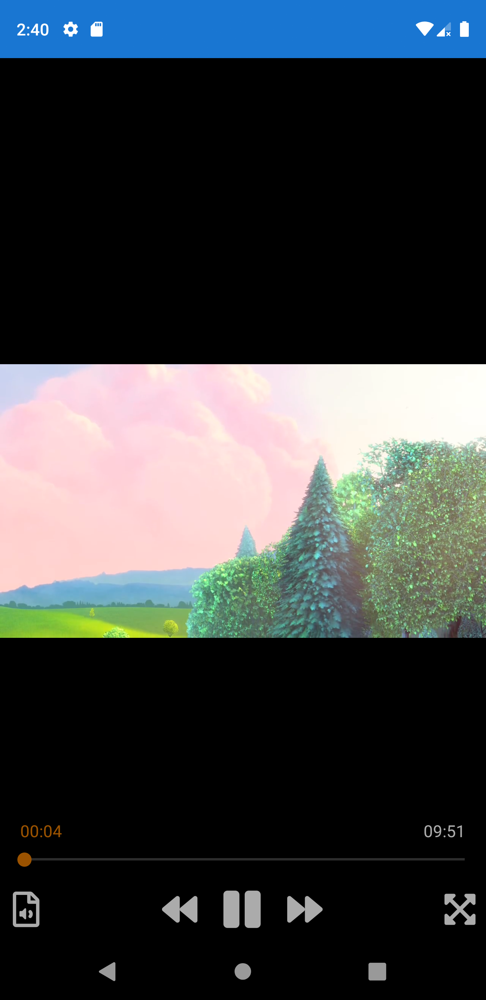

# libvlcsharp
LibVLCSharp is a cross-platform audio and video API for .NET platforms based on VideoLAN's LibVLC Library. It provides a comprehensive multimedia API that can be used across mobile, server and desktop to render video and output audio as well as encode and stream.
## More: https://github.com/videolan/libvlcsharp

## Nugets used
1. LibVLCSharp
2. LibVLCSharp.Forms
3. VideoLAN.LibVLC.Android
4. VideoLAN.LibVLC.iOS

Make sure you include FontAwesome fonts. 

## Features
AES File encryption and Decryption on Android 
Play video with decrypted file and remove temp file.

## Preview

